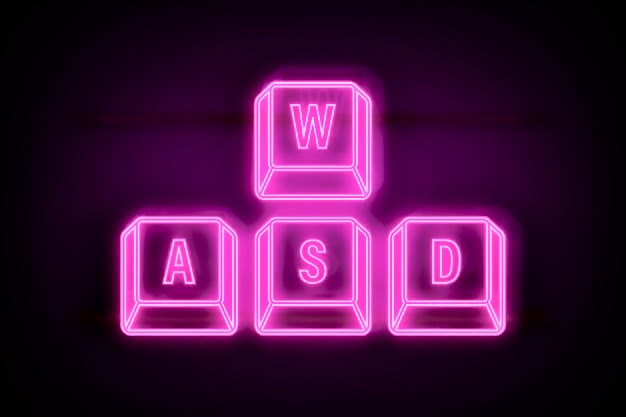
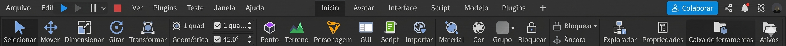
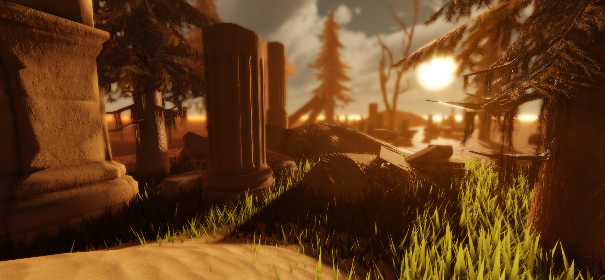

<!DOCTYPE html>
<html>
<head>

</head>
<body>

  <h1> Gabriel Dev Academy 🚀</h1>
  
Aprenda a criar jogos incríveis no Roblox do zero.

  <h2>📚 Aulas</h2>
  <ul>
    <li>Como fazer porta automática</li>
    <li>Sistema de vida</li>
    <li>Loja de espadas</li> 
    <li>iluminação proficional</li>
      <li>Aprenda a trabalhar com modelos 3D no blender</li>

<!DOCTYPE html>
<html>
<head>

</head>
<body>
  
  <h1> Veja Minhas aulas link abaixo.</h1>
  
<h1>Bem-vindo</h1>

<a href="https://www.youtube.com/@DevBuilderStudio" target="_blank">
  🔴 Meu canal no YouTube
</a>

</body>
</html>

  </ul>

  <h2>🎮 Meus Projetos</h2>
  
Em breve você verá meus jogos aqui.

  <h2>🔥 Sobre mim</h2>
  
Sou um criador de jogos e futuro empresário criando minha própria plataforma.

  
  🎮 Guia Básico do Roblox Studio

  
🧭 Movimentação na Câmera

Use essas teclas para navegar na visão do estúdio:

W, A, S, D → mover a câmera
Q → subir
E → descer
Shift + W/A/S/D → mover mais rápido
R → girar o objeto selecionado
🖱️ Controles do Mouse
Botão direito + arrastar → olhar ao redor
Scroll (rodinha) → zoom
Botão esquerdo → selecionar objetos
🧱 Ferramentas principais
  

  <h2>🎥 Aula de Iluminação no Roblox</h2>

Aprenda a melhorar a iluminação do seu jogo no Roblox Studio.

  Na Aba Principal temos as ferramentas:

  

Na aba “Home” ou “Model” você vai usar:

Move → mover objetos
Scale → aumentar/diminuir
Rotate → girar objetos
Select → selecionar

🧠 Dica importante
Use Shift + clique pra selecionar vários objetos
Use Ctrl + D para duplicar
Use Delete para apagar

🎯 Sistema de construção
Clique em Part para criar blocos
Use Material para mudar textura
Use Color para mudar a cor
Ajuste tamanho com Scale

🚀 Dica avançada (pra ficar profissional)
Use Snap to Grid pra alinhar tudo certinho
Use Anchor pra deixar o objeto parado (não cair)
  
</body>
</html>

 Guia completo de como ter a melhor iluminação para seu jogo.

 O serviço Lighting contém propriedades que você pode ajustar para atualizar e personalizar a iluminação global em uma experiência. Existem cinco categorias de propriedades de iluminação:

Cor — Configura o tom dentro da experiência.

Intensidade — Configura a intensidade ou a quantidade de luz que atinge a câmera.

Sombras — Configura como um usuário percebe as sombras dentro da experiência.

Aparência — Propriedades que determinam o estilo de iluminação e a qualidade de iluminação/sombreamento ou priorização da distância de visualização.

Ambiente — Configura as condições do mundo da experiência, como a hora do dia e a latitude geográfica.
 

GUIA COMPLETO DE COMO TER UMA ILUMINAÇÃO COMO NA FOTO NO SEU ROBLOX STUDIO:

💡 Configurações de Lighting no Roblox Studio

🌑 Ambient

Define a iluminação geral das sombras do mapa (o que fica escuro não fica totalmente preto).
👉 Configuração: [0, 0, 0]
(ou [16, 16, 16] se quiser sombras mais claras)

☀️ Brightness

Controla a intensidade da luz do “sol”.
👉 Configuração: 4
(pode ir até 10, mas 4 já fica bonito e realista)

🎨 ColorShift_Top

Muda a cor da iluminação nas partes de cima (luz do ambiente).
👉 Configuração: [255, 191, 146]
(dá um tom quente e realista, tipo pôr do sol sexy 😮‍🔥)

🎨 ColorShift_Bottom

Muda a cor da iluminação nas partes de baixo (sombras/reflexos).
👉 Configuração: [0, 0, 0]

🌍 EnvironmentDiffuseScale

Controla como a luz se espalha pelo ambiente.
👉 Configuração: 0.043

✨ EnvironmentSpecularScale

Define o brilho/reflexo das superfícies.
👉 Configuração: 0.635

🌑 GlobalShadows

Ativa sombras reais no jogo.
👉 Configuração: Ativado ✅

🎭 LightingStyle

Define o estilo da iluminação.
👉 Configuração: Soft
(deixa tudo mais suave e bonito)

🌌 OutdoorAmbient

Define a cor da luz externa nas sombras.
👉 Configuração: [0, 0, 0]

⚡ PrioritizeLightingQuality

Prioriza qualidade ao invés de performance.
👉 Configuração: Ativado ✅

⏰ ClockTime

Define o horário do dia no jogo.
👉 Configuração: 8.977
(manhãzinha com luz bonita)

🌎 GeographicLatitude

Controla a posição do sol no mapa.
👉 Configuração: -51.549

💬 Dica final (presta atenção aqui 👀):
Essas configs são estilo “mapa bonito e realista”. Se quiser algo mais dark, terror ou futurista, dá pra brincar MUITO com o ColorShift e Brightness.
